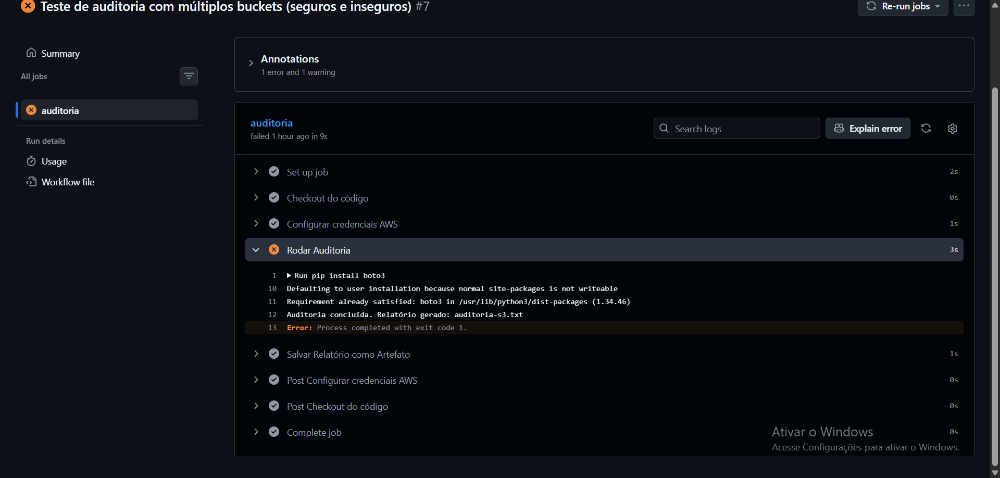
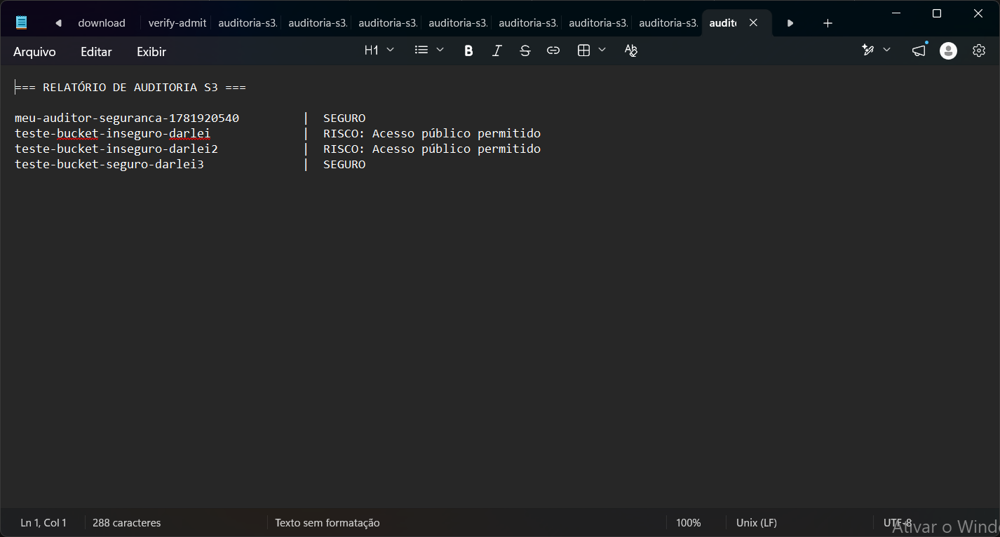
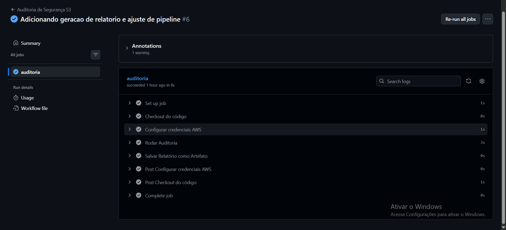
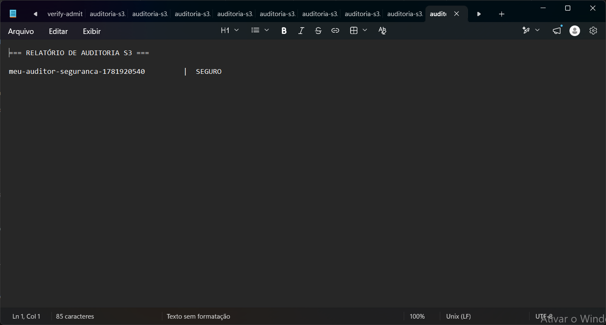

# 🛡️ Cloud Security Auditor

Um sistema automatizado de **auditoria de conformidade** para Buckets AWS S3. Projetado para detectar configurações de risco em tempo real e integrar segurança diretamente ao ciclo de desenvolvimento (CI/CD).

## 💡 O Problema
Configurações incorretas em buckets S3 são uma das maiores causas de vazamento de dados na nuvem. Revisar permissões manualmente em ambientes com múltiplos buckets é ineficiente e propenso a erros humanos.

## 🚀 A Solução e Evidências
O **Cloud Security Auditor** automatiza essa verificação. Ele varre a conta AWS em busca de desativação do "Public Access Block" e, se encontrar, interrompe o pipeline de CI/CD (**Fail-Fast**).

### 🛑 Cenário: Detecção de Risco
Quando o pipeline detecta buckets inseguros, ele força uma falha, impedindo que infraestruturas vulneráveis sejam mantidas.

**Figura 1: Pipeline Interrompido por Falha de Segurança**

**Figura 2: Detalhes do Log de Auditoria (Risco Detectado)**

---

### ✅ Cenário: Ambiente Seguro
Quando todos os buckets seguem as políticas de "Block Public Access", o pipeline é concluído com sucesso.

**Figura 3: Pipeline Concluído com Sucesso**

**Figura 4: Relatório de Auditoria (Ambiente Seguro)**

---

## 🛠️ Tecnologias
* **AWS Boto3:** Para interação programática com a infraestrutura AWS.
* **GitHub Actions:** Orquestração de pipelines para execução contínua (CI/CD).
* **Cloud Security (DevSecOps):** Governança e controle de acesso preventivo.

## ⚙️ Configuração
Para rodar este projeto, configure as variáveis de ambiente no seu repositório:
- `AWS_ACCESS_KEY_ID`
- `AWS_SECRET_ACCESS_KEY`

---
*Projeto desenvolvido por [Darlei Vieira](https://github.com/DarleiVN)*